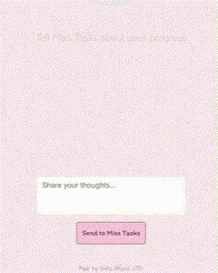
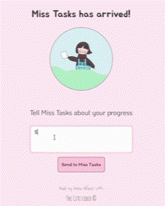
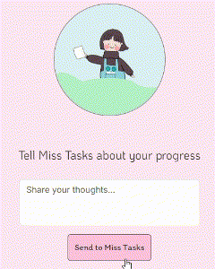

# Miss Tasks! <🌸/>

Meet Miss Tasks, your sweet little productivity companion 🌸✨.
She listens as you share how you're doing with your tasks, then responds based on your emotional tone 💬💌.

## Visual Overview 🍓

## Languages 💻

HTML, CSS, JavaScript

## Libraries & Tools ⭐

ReactJs, Bootstrap, Axios, Node.js, Express, Sentiment package (for sentiment analysis)

## Features 🌟

1. Write about how you're doing 💌
2. App analyzes your mood through text 💕
3. Clean and simple UI with Bootstrap styling 🎀
4. Cheerful and motivating user experience 💖

## Visual Example of a Response 🌟

## Visual Example of Empty Message Response 🌟

## Behind the Magic 💫

Custom sentiment analysis powers the kind and uplifting responses you get from Miss Tasks 💬✨

## Last Note 🌼
**This is one of my most emotionally engaging apps 🍒🚀**

### Thanks for reading ♡ ⋆｡˚
